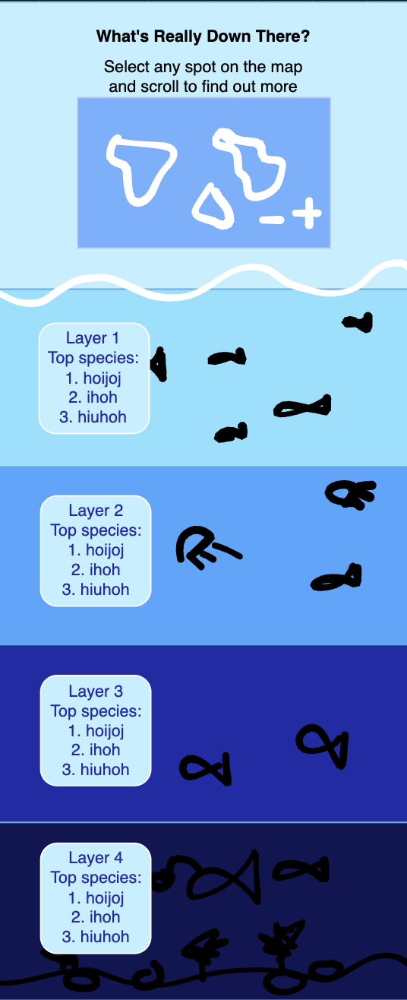
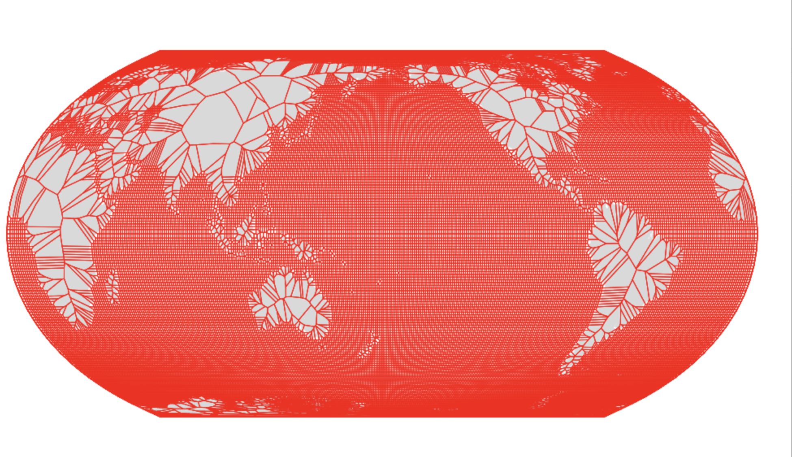
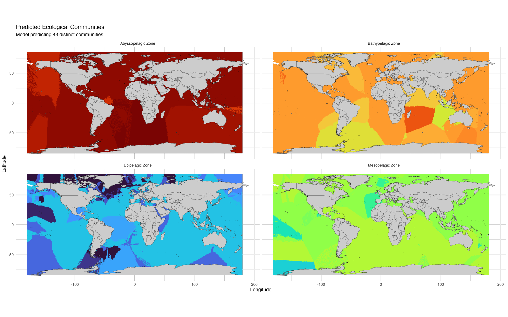
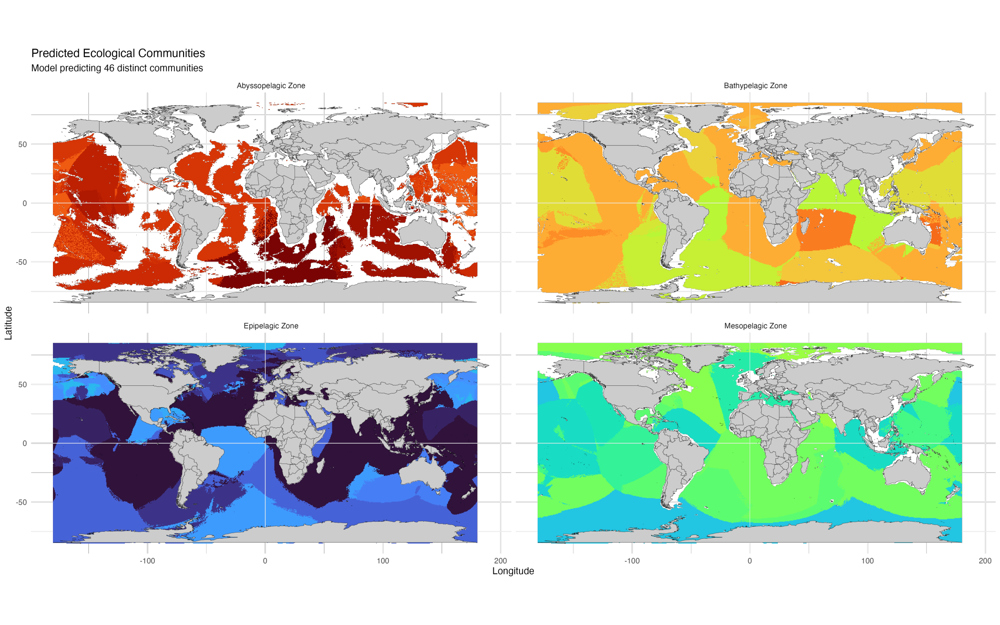
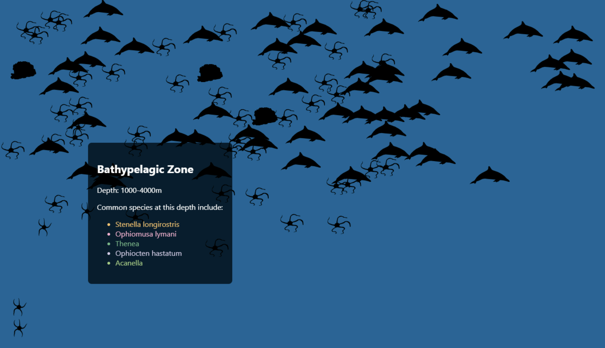
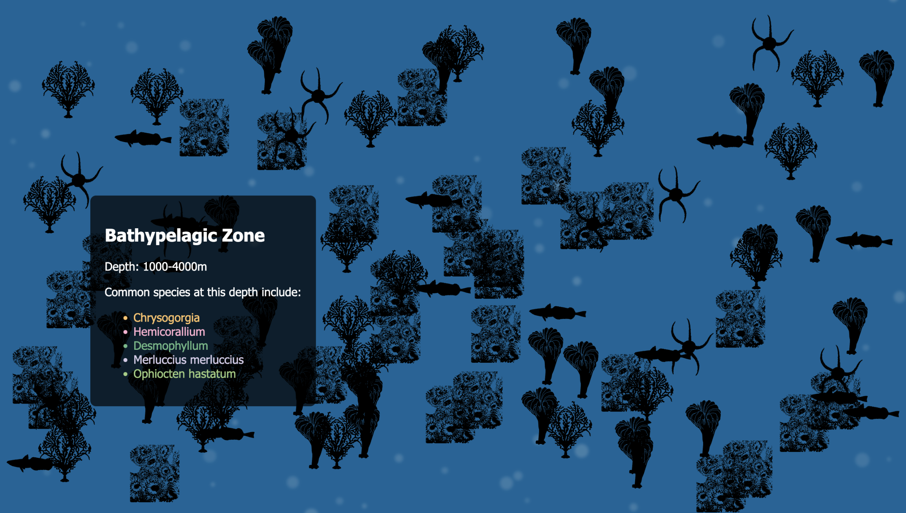
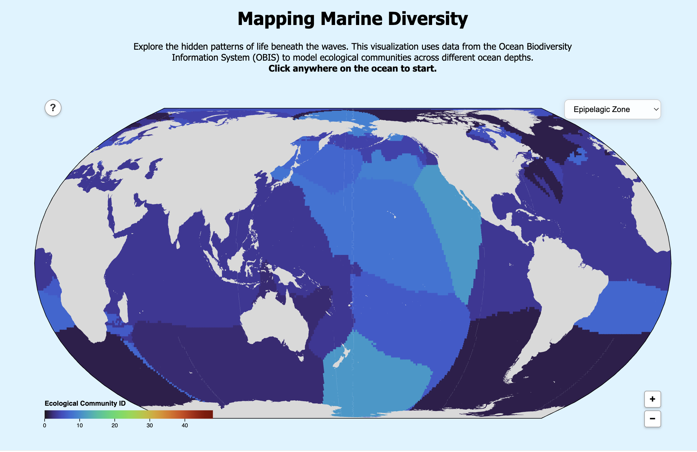
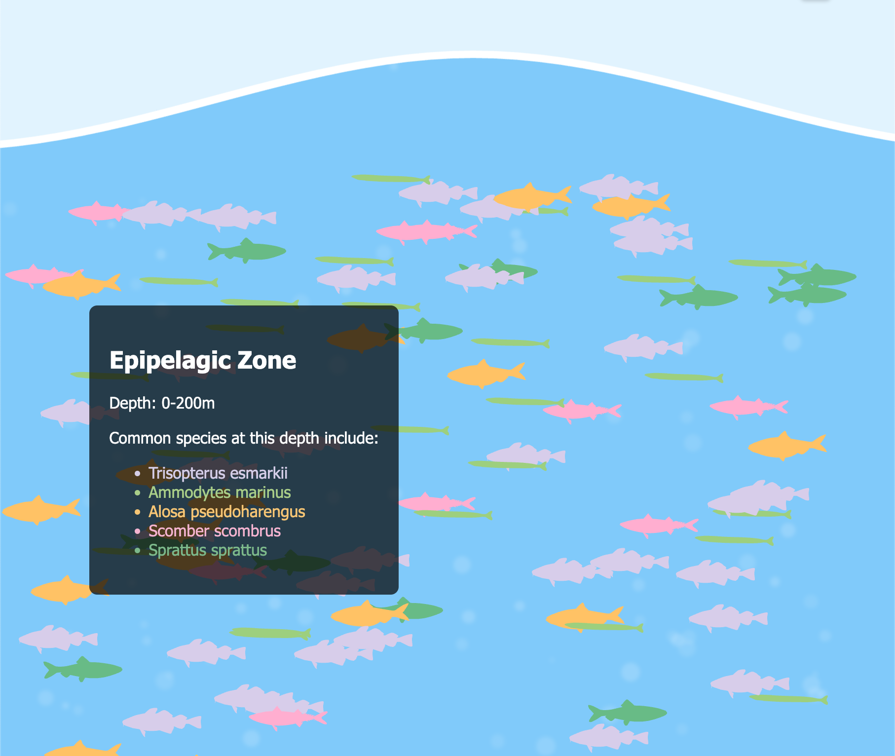
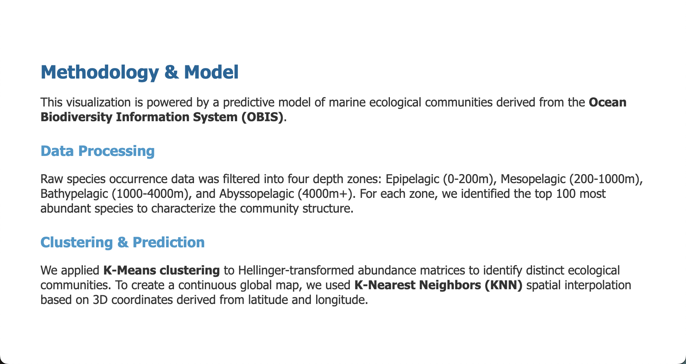

# Process Book: Marine Diversity Dive

## Overview and Motivation
The ocean covers 70% of our planet, yet the deep sea remains largely unexplored. This project, "Marine Diversity Dive," aims to visualize the distribution of marine biodiversity across different depth zones—from the sunlit Epipelagic zone to the dark Abyssopelagic zone. By leveraging data from the Ocean Biodiversity Information System (OBIS), we seek to reveal patterns in species composition and ecological communities that are often hidden beneath the surface. The motivation is to make complex biodiversity data accessible and engaging through an interactive "dive" experience, allowing users to see not just where marine life is, but how it changes as they descend.

## Related Work
*   **OBIS (Ocean Biodiversity Information System)**: The primary source of our data and an inspiration for global-scale marine mapping.d
*   **"The Deep Sea" by Neal.fun**: Inspired the vertical scrolling interaction to represent depth.
  
## Questions
1.  **How does species composition change with depth?** We wanted to see if the dominant species in the surface layer are completely different from those in the abyss.
2.  **Can we identify distinct ecological communities?** Rather than just mapping individual species, can we group them into "communities" based on co-occurrence?
3.  **How are these communities distributed globally?** Are deep-sea communities more uniform across the globe compared to surface communities?

*Evolution*: Initially, we asked simple questions about abundance (e.g., "Where are the most fish?"). However, we realized abundance is heavily biased by sampling effort. We shifted our questions to focus on *composition* and *community structure* using clustering algorithms, which provides a more robust view of biodiversity patterns.

## Data
The project relies on marine species abundance data processed through a custom pipeline.

### Source
Data is sourced from the **OBIS (Ocean Biodiversity Information System)** dataset. We accessed the data directly from their S3 bucket using **DuckDB** and R (`data/pull_data.r`). This allowed us to query massive parquet files efficiently without downloading terabytes of data. We also used bathymetry data from NOAA and data on species phylogeny from NCBI.

### Processing Pipeline (`model_biodiversity.r`)
1.  **Cleaning & Filtering**: 
    - We filter species to ensure they are only represented in depth layers where they are actually abundant (threshold > 20% of total occurrence).
    - We explicitly prune surface taxa (e.g., *Stenella*, *Delphinus*) from deep zones (Bathypelagic/Abyssopelagic) to correct for potential data mislabeling or net contamination.
2.  **Bathymetry Masking**: 
    - Using the `marmap` R library, we fetch NOAA bathymetry data to mask the prediction grid. This ensures deep-sea communities are not predicted in shallow coastal waters.
3.  **Community Modeling (K-Means)**: 
    - We use K-Means clustering on Hellinger-transformed abundance matrices to identify distinct ecological communities.
    - We balance the training data by sampling spatially to prevent over-representation of well-sampled regions.
4.  **Spatial Interpolation (KNN)**: 
    - We use K-Nearest Neighbors (KNN) to interpolate these community IDs across a global 1x1 degree grid, converting lat/lon to 3D Cartesian coordinates for accurate spherical distance calculation.

### Dataset Structure
Below are samples of the processed datasets generated by our pipeline.

#### 1. `predicted_communities.csv`
This file drives the global map visualization. It contains the predicted ecological community for every grid point in the ocean.

| lat_bin | lon_bin | depth_layer | predicted_community_id |
|:---|:---|:---|:---|
| -84.5 | -180 | Epipelagic Zone | 1 |
| -84 | -180 | Epipelagic Zone | 1 |
| -83.5 | -180 | Epipelagic Zone | 1 |

*   **lat_bin / lon_bin**: The center coordinates of the 0.5-degree spatial grid cell.
*   **depth_layer**: The vertical zone (Epipelagic, Mesopelagic, etc.).
*   **predicted_community_id**: An integer ID representing the specific ecological cluster assigned to this location.

#### 2. `community_composition.csv`
This file provides the biological context for each community ID, listing the top species found within it.

| community_id | species | avg_abundance |
|:---|:---|:---|
| 1 | *Trisopterus esmarkii* | 713.640300669005 |
| 1 | *Ammodytes marinus* | 698.866009240618 |
| 1 | *Alosa pseudoharengus* | 257.034963106 |

*   **community_id**: Matches the ID in the grid file.
*   **species**: The scientific name of the dominant species.
*   **avg_abundance**: The average number of individuals of this species found in samples assigned to this community.

#### 3. `raw_species_data.csv`
The aggregated raw data from OBIS before clustering.

| kingdom | genus | species | lat_bin | lon_bin | depth_layer | sighting_frequency | total_abundance |
|:---|:---|:---|:---|:---|:---|:---|:---|
| Animalia | Aaptos | Aaptos | -26.6 | 15.1 | Epipelagic Zone | 1 | 1 |
| Animalia | Aaptos | Aaptos | -21.6 | 114.9 | Epipelagic Zone | 1 | 1 |
| Animalia | Aaptos | Aaptos | -21.5 | 115 | Epipelagic Zone | 1 | 1 |

*   **total_abundance**: Sum of individual counts for that species in that bin/layer.

## Exploratory Data Analysis
We used `ggplot2` in R to generate static heatmaps of species abundance and preliminary cluster maps.

*   **Insight 1**: Raw abundance maps were extremely patchy, reflecting shipping lanes and research expeditions rather than true biological distribution. This informed the decision to use **KNN interpolation** to smooth the visual output.
*   **Insight 2**: Surface species (like tuna) dominated the dataset. If we analyzed all depths together, deep-sea signals were lost. This led to the design decision to **model each depth layer independently**, ensuring deep-sea communities were properly represented.
*   **Insight 3**: The bathymetry is crucial. Early visualizations showed "deep sea" communities on land. We added a bathymetry filter to strictly mask invalid depths.

## Design Evolution

### Initial Sketches

We were pretty clear from the beginning on the finished concept that we wanted. We wanted, firstly, the ability to select any spot in the ocean on a map. Then, the user should be able to scroll through each layer of the ocean and see a representation of the biodiversity there.

### Prototypes

One of the first things we worked on was implementing a voronoi map where you could click on cells. However, one of the main issues was that it was very slow to load. We also found that the cells were malformed in ways you couldn't see, causing a large part of the map to be all part of one big cell. This was problematic and resulted in switching to a grid-based system using D3 Delaunay, which is much faster and cleaner.

After the map, a main priority became transforming the data from OBIS into something usable. We decided to narrow the scope of our project by focusing on characterizing the different communities that exist. So, we made a script for modelling the biodiversity and mapping the distinct ecological communities across the four ocean depth zones by applying machine learning to the species occurrence data from OBIS. For each zone, the script selected the most abundant species, builds a site-by-species abundance matrix, and uses K-Means clustering on a spatially balanced subset of sites to define unique community types, effectively mitigating sampling bias. These clusters are then interpolated onto a global coordinate grid using K-Nearest Neighbors (KNN), post-processed to mask out land areas using the sf package, and finally exported as CSV datasets and a static PNG map visualizing the global distribution of these marine communities

However, it quickly became clear that some areas were very low confidence, causing a dithering effect, and that the model was also hallucinating data for regions that aren't deep enough to have certain ocean layers.

We then updated it to use NOAA ocean depth data, account for the globe being a round surface in nearest neighbor calculations instead of treating it like a flat grid, and used the hellinger transformation to prevent super abundant species from skewing things too much. This was the first of many changes that improved our model quality. 

Cole started using the PhyloPic API to find images of each animal and plant. This was difficult because many species in our data, especially at deep layers, were rare. He had to implement a process using NCBI data to identify another close ancestor to use as the image.

The model also stil wasn't perfect. As we began to implement the visualization, it became clear that sometimes species that are very abundant in higher layers and occasionally dive down to lower layers would show up in zones that they don't actually live. For example, the internet verified that dolphins do not spend time this far down in the ocean. In this case, we added a cuttoff where if it is very rare for a species to occur in a certain layer compared to others, it should not be considered in that layer. This was one of many bugs we had to address.

Another issue was that plants, and even some animals (like coral!) do not swim like the fish we were implementing. So, we had to work out a way to keep plants and corals on the ground.

We finally completed our first page of the website with a really nice map. The user is able to toggle between different layers to see all the ecological communities that we identified, which are color coded. We also added final map functionalities including the more information button, zoom in/ zoom out, and ability to pan.

We started adding color coding to all the fish. At this point you can also start to see that Sarah wa s adding decorations such as waves, bubbles, pebbles, and small sand dunes to enhance the visual appeal. The project started to feel like it was coming together, with one main caveat: the NCBI rate limiting was so severe that we were unable to consistently load the right assets. 

We also added a section for methodology, so the user has the option to understand more about how our data was created.

## Implementation
*Describe the intent and functionality of the interactive visualizations you implemented. Provide clear and well-referenced images showing the key design and interaction elements.*

### Architecture
The project uses a static site structure with:
- **HTML/CSS/JS**: For the frontend interface (`index.html`, `main.js`, `style.css`).
- **D3.js (v7)**: For rendering the interactive map and handling data binding.
- **R**: For heavy data lifting, clustering, and generating the `predicted_communities.csv` and `community_composition.csv` files used by the frontend.

### Key Features
- **Global Map**: A D3-based map that visualizes the predicted communities. Users can click to select a specific coordinate.
- **Scrollytelling Dive**: As the user scrolls, an `IntersectionObserver` triggers transitions between depth zones:
  1. Epipelagic Zone (0-200m)
  2. Mesopelagic Zone (200-1000m)
  3. Bathypelagic Zone (1000-4000m)
  4. Abyssopelagic Zone (4000m+)
- **Sticky Visualization**: The visualization panel (`#vis-sticky`) remains fixed while text content scrolls over it, maintaining context.

## Evaluation
*   **Findings**: The visualization clearly shows that biodiversity "hotspots" shift as you go deeper. Surface hotspots don't always align with deep-sea hotspots.
*   **Performance**: The KNN model provides a good approximation, but the transition between zones can be abrupt.
*   **Future Improvements**:
 
### 1. Visualization Scalability & Performance
The current implementation relies on SVG elements for rendering marine life. While effective for the current scale, this approach places a heavy load on the DOM and may encounter performance bottlenecks as the number of animated entities increases.
*   **Proposal**: Transition the rendering engine to **HTML5 Canvas** or **WebGL** (using libraries like PixiJS or Three.js). This would enable the simulation of thousands of organisms and complex particle effects at a consistent 60 FPS, significantly enhancing the immersive quality of the dive without lagging the browser.

### 2. Responsive & Adaptive Layouts
The dive visualization currently initializes based on the window dimensions at the moment the dive starts. If a user resizes their browser or rotates their device, elements may become misaligned.
*   **Proposal**: Implement a robust **Resize Observer** system. This would dynamically recalculate spatial coordinates and scales for the sea floor and organisms when the browser window is resized, ensuring a consistent experience across all devices and screen orientations.

### 3. Enhanced Interactivity
Currently, the user experience is primarily observational (scrollytelling).
*   **Proposal**: Introduce an **Interactive Layer** where users can click on individual species to access detailed "Species Cards". These cards could display taxonomic classification, abundance statistics, and biological facts, transforming the visualization from a passive viewing experience into an active educational tool.

## References
- D3.js
- DuckDB
- R packages: `dplyr`, `tidyr`, `class`, `ggplot2`, `sf`, `marmap`
- Neal fun deep sea visualization https://neal.fun/deep-sea/ 
